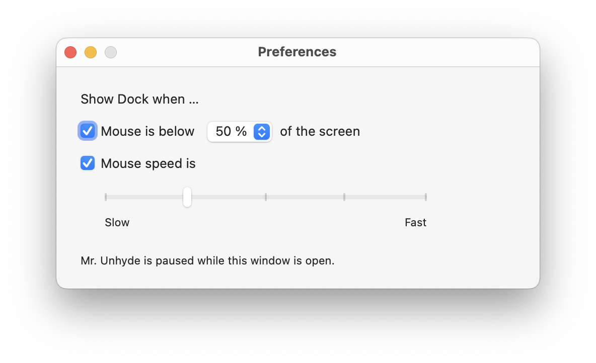

# Mr. Unhyde

This is an old OS X menu bar application that I had lying around on my computer.

The original use case was this: With the OS X Dock hidden (to save screen estate), it automatically un-hides the Dock when the mouse is near the bottom screen **and** the mouse movement exceeds a certain acceleration.

The dependency on mouse acceleration was important so that you can still use the mouse on the bottom half of the screen without the Dock constantly moving up and down.

***

I began rewriting this application in October 2023. You can configure Mr. Unhyde with the preferences below. Currently, the Dock must be on the bottom side of the screen, and the default shortcut for toggling the Dock (`Cmd+Opt+D`) must be set and enabled. Like similar applications, Mr. Unhyde must be granted macOS' _Accessibility_ rights (done in System Preferences).




## License


```
Copyright (C) 2016-2024 Eroica

This software is provided 'as-is', without any express or implied
warranty. In no event will the authors be held liable for any damages
arising from the use of this software.

Permission is granted to anyone to use this software for any purpose,
including commercial applications, and to alter it and redistribute it
freely, subject to the following restrictions:

1. The origin of this software must not be misrepresented; you must not
   claim that you wrote the original software. If you use this software
   in a product, an acknowledgment in the product documentation would be
   appreciated but is not required.
2. Altered source versions must be plainly marked as such, and must not be
   misrepresented as being the original software.
3. This notice may not be removed or altered from any source distribution.
```
